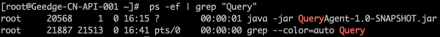

- wget

  使用wget下载单个文件
   `wget http://www.centos.bz/download?id=1`

  使用wget -O下载并以不同的文件名保存
  `wget -O wordpress.zip http://www.centos.bz/download.php?id=1080`

  使用wget -b后台下载
  `wget -b http://cn.wordpress.org/wordpress-3.1-zh_CN.zip`
  `tail -f wget-log` 查看下载进度

- docker

  `docker ps -a` 查看容器是否运行

  `docker exec -it 容器id bash` 进入容器

  `docker start/stop 容器id` 

  `docker images` 查看本地已有的所有镜像

- mysql 

  `mydql -uroot -p` 登录数据库
  
- 后台进程

  `nohup  command &`   eg: 后台运行命令command

  `jobs -l` 查看当前终端运行的后台进程（终端关闭过的后台进程显示不出）

  `ps -ef`  搭配 `grep 关键字` 查找机器后台运行的相关程序，eg: ps -ef | grep "Query" 
  

  `kill -9 进程号` 关闭进程

- 文件权限

  

  

  常用编码：777、754、755

  `chmod 777 file `  把file的操作权限设置为777全部用户可读可写可执行

  `chmod -R a+wr file` 将目录file下和所有子目录的所有用户增加读和写权限

- 查看系统信息

  `cat /proc/version`

- vim批量替换字符串
  - `:1,$s/originalstring/newstring/g`
  - 注意，如果有特殊字符需转义，如换行\n

